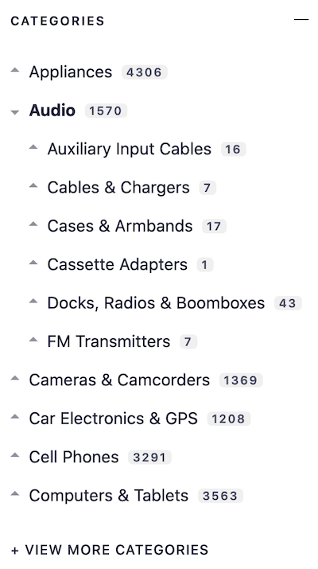
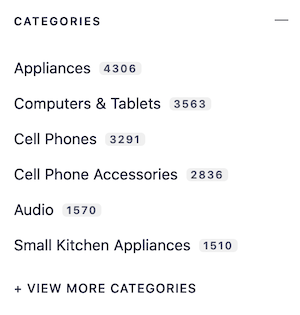
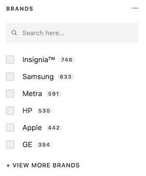
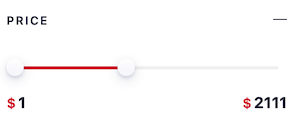

# E-Commerce Unified UI

<p align="center">

</p>

**This project aims to be used by any e-commerce website to bootstrap a search experience powered by Algolia the fastest way possible.**

While you would still have to push your data to Algolia, the goal of E-Commerce Unified is to remove the need of implementing front-end logic and be able to start using Algolia as quickly as possible.

### Prerequisites

- Node >= 12
- Yarn

// @todo @sarah

### Getting started

Follow the few steps described below to start using E-Commerce Unified UI.

1. **Push your data to Algolia** (following the [required data schema](#customizing-the-search-ui)),
2. [**Fork** this Github repository](https://help.github.com/en/github/getting-started-with-github/fork-a-repo) to your own,
3. **Replace the values in `src/config/index.js`** to better match your needs,
4. **Run `npm run build` (or `yarn build`)** to build the `unified-instantsearch.js` files,
5. **Host and include the `unified-instantsearch.js` file** on your front-end and start using!

#### Instructions

// @todo @sarah

#### Commands

You have access to a handful of [command-line scripts](https://docs.npmjs.com/misc/scripts) to test your project during customization and build it once you're done.

You can run each command with npm or Yarn. For example, to run the `start` command, you can run either `npm run start` or `yarn start`.

| Command Name | Comments                                                                      |
| ------------ | ----------------------------------------------------------------------------- |
| `start`      | Run the project in development mode, within a fake e-commerce website.        |
| `preview`    | Build the project for previewing in the context of a fake e-commerce website. |
| `export`     | Export the production JavaScript file to include in your website.             |
| `lint`       | Look for linting issues (useful when customizing the project).                |
| `lint:js`    | Look for linting issues in the JavaScript code.                               |
| `lint:css`   | Look for linting issues in the CSS/Sass code.                                 |

### Configuration options

The `src/config/index.js` file describes the available options supported by Unified InstantSearch.

#### `appId`

> `string` | required

Your Algolia Application ID ([find it on your Algolia account](https://www.algolia.com/api-keys)).

#### `apiKey`

> `string` | required

Your Algolia Search-Only API Key ([find it on your Algolia account](https://www.algolia.com/api-keys)).

#### `index`

> `object` | required

Your Algolia index settings:

| Key | Type | Description |
| --- | --- | --- |
| `indexName` | `string` | Your Algolia index name. |
| `searchParameters` | [`SearchParameters`](https://www.algolia.com/doc/api-reference/search-api-parameters/) | The [search parameters](https://www.algolia.com/doc/api-reference/search-api-parameters/) to use. |

#### `suggestionsIndex`

> `object`

Your Algolia [Query Suggestions](https://www.algolia.com/doc/guides/getting-insights-and-analytics/leveraging-analytics-data/query-suggestions/) index:

| Key | Type | Description |
| --- | --- | --- |
| `indexName` | `string` | Your Algolia index name. |
| `searchParameters` | [`SearchParameters`](https://www.algolia.com/doc/api-reference/search-api-parameters/) | The [search parameters](https://www.algolia.com/doc/api-reference/search-api-parameters/) to use. |

The Query Suggestions index is used to display suggestions below the search box and in the "no results" page.

Make sure that Query Suggestions is available on your [Algolia plan](https://www.algolia.com/pricing/).

#### `inputSelector`

> `string` | required

The [CSS selector](https://developer.mozilla.org/en-US/docs/Web/CSS/CSS_Selectors) that targets the DOM element to inject the search button into.

#### `inputContent`

> `string | ReactNode` | required

The content to display in the search button.

#### `keyboardShortcuts`

> `string[]`

The keyboard shortcuts to use to display the search overlay.

#### `hitComponent`

> `(props: { hit: Hit, insights: Insights, view: "grid"|"list" }) => JSX.Element` | required

The hit component to display in the list of hits.

You have access to the following props:

| Prop | Type | Description |
| --- | --- | --- |
| `hit` | [`Hit`](https://www.algolia.com/doc/guides/building-search-ui/going-further/backend-search/in-depth/understanding-the-api-response/#hits) | The hit returned by Algolia. |
| `insights` | [`Insights`](https://www.algolia.com/doc/api-client/methods/insights/) | The Insights function bound to the `index`, `userToken`, `queryID`, `objectIDs` and `positions` so that you only have to specify the `eventName`. |
| `view` | `"grid" | "list"` | The current view mode. |

#### `setUserToken`

> `(setToken: (userToken: string) => void) => void`

Function to set the [`userToken`](https://www.algolia.com/doc/api-reference/api-parameters/userToken/) to allow [Personalization](https://www.algolia.com/doc/guides/getting-insights-and-analytics/personalization/what-is-personalization/).

**Example:**

```js
const config = {
  // ...
  setUserToken(setToken) {
    // Assuming you store the `userToken` in a global variable
    setToken(window.ALGOLIA_USER_TOKEN);
    // Or if you store the `userToken` in an external API
    fetchTokenAsynchronously().then(({ token }) => setToken(token));
  },
};
```

#### `googleAnalytics`

> `boolean`

Whether to send events to [Google Analytics](https://analytics.google.com/) when queries are triggered.

This assumes that the global Google Analytics object `aa` is available on `window`.

#### `refinements`

See [Refinements](#refinements).

#### `sorts`

See [Sorting](#sorting).

#### `styles`

See [Customizing breakpoints](#customizing-breakpoints).

### Customizing the search UI

The configuration file allows to customize the search UI: what refinements to display, what sorting strategy to use, etc.

#### Refinements

A refinement acts as a search filter that is added to the left panel of the search UI. Refinements' order follows their declaration order in the configuration file.

Each refinement object contains the following properties:

| Key | Type | Description | Preview |
| --- | --- | --- | --- |
| `type` | `"list" | "category" | "hierarchical" | "slider"` | The type of the refinement. |
| `header` | `string` | The content to display in the refinement panel header. |  |
| `label` | `string` | The label to display in the active refinements. |  |
| `options` | `object` | The refinement options forwarded to the InstantSearch widget |

The attributes provided to the refinements' options must be added in attributes for faceting, either on the [Algolia dashboard](https://www.algolia.com/explorer/display/) or using [`attributesForFaceting`](https://www.algolia.com/doc/api-reference/api-parameters/attributesForFaceting/) with the Algolia API.

**Example:**

```js
const config = {
  // ...
  refinements: [
    {
      {
      type: 'list',
      header: 'Brands',
      label: 'Brand',
      options: {
        attribute: 'brand',
      },
    },
    }
  ]
}
```

##### Hierarchical

| Preview |  |
| --- | --- |
|  | The hierarchical refinement creates a navigation based on a hierarchy of facet attributes. It is commonly used for categories with subcategories. |

###### Record schema

The objects to use in the hierarchical menu must follow this structure:

```json
[
  {
    "objectID": "321432",
    "name": "lemon",
    "categories.lvl0": "products",
    "categories.lvl1": "products > fruits"
  },
  {
    "objectID": "8976987",
    "name": "orange",
    "categories.lvl0": "products",
    "categories.lvl1": "products > fruits"
  }
]
```

It’s also possible to provide more than one path for each level:

```json
[
  {
    "objectID": "321432",
    "name": "lemon",
    "categories.lvl0": ["products", "goods"],
    "categories.lvl1": ["products > fruits", "goods > to eat"]
  }
]
```

###### Options

| Key | Type | Description |
| --- | --- | --- |
| `type` | `"hierarchical"` | The type of the refinement. |
| `header` | `string` | The content to display in the refinement panel header. |
| `label` | `string` | The label to display in the active refinements. |
| `options` | `object` | The [options forwarded to the `HierarchicalMenu` InstantSearch widget](https://www.algolia.com/doc/api-reference/widgets/hierarchical-menu/react/#props). |

**Example:**

```js
const config = {
  // ...
  refinements: [
    {
      type: 'hierarchical',
      header: 'Categories',
      label: 'Category',
      options: {
        attributes: [
          'hierarchicalCategories.lvl0',
          'hierarchicalCategories.lvl1',
        ],
        limit: 6,
        showMore: true,
      },
    },
  ],
};
```

##### Category

| Preview |  |
| --- | --- |
|  | The category refinement displays a menu that lets the user choose a single value for a specific attribute. |

###### Options

| Key | Type | Description |
| --- | --- | --- |
| `type` | `"category"` | The type of the refinement. |
| `header` | `string` | The content to display in the refinement panel header. |
| `label` | `string` | The label to display in the active refinements. |
| `options` | `object` | The [options forwarded to the `Menu` InstantSearch widget](https://www.algolia.com/doc/api-reference/widgets/menu/react/#props). |

**Example:**

```js
const config = {
  // ...
  refinements: [
    {
      type: 'category',
      header: 'Categories',
      label: 'Category',
      options: {
        attribute: 'category',
        limit: 6,
        showMore: true,
      },
    },
  ],
};
```

##### List

| Preview |  |
| --- | --- |
|  | The list refinement is one of the most common widgets that you can find in a search UI. With this widget, the user can filter the dataset based on facet values. The widget only displays the most relevant facets for the current search context. This widget also implements search for facet values, which is a mini search inside the values of the facets. This makes it easy to deal with uncommon facet values. |

###### Options

| Key | Type | Description |
| --- | --- | --- |
| `type` | `"list"` | The type of the refinement. |
| `header` | `string` | The content to display in the refinement panel header. |
| `label` | `string` | The label to display in the active refinements. |
| `options` | `object` | The [options forwarded to the `RefinementList` InstantSearch widget](https://www.algolia.com/doc/api-reference/widgets/refinement-list/react/#props). |

**Example:**

```js
const config = {
  // ...
  refinements: [
    {
      type: 'list',
      header: 'Brands',
      label: 'Brand',
      options: {
        attribute: 'brand',
        searchable: true,
        showMore: true,
        limit: 6,
      },
    },
  ],
};
```

##### Slider

| Preview |  |
| --- | --- |
|  | The slider refinement provides a user-friendly way to filter the results, based on a single numeric range. |

###### Record schema

The values inside `attribute` must be numbers, not strings.

###### Options

###### Options

| Key | Type | Description |
| --- | --- | --- |
| `type` | `"slider"` | The type of the refinement. |
| `header` | `string` | The content to display in the refinement panel header. |
| `label` | `string` | The label to display in the active refinements. |
| `options` | `RefinementOptions` | The options of the refinement. |

**RefinementOptions:**

| Name | Type | Description |
| --- | --- | --- |
| `transformValue` | `(value: number) => ReactNode` | Function to transform the min and max values displayed. |

**Example:**

```js
const config = {
  // ...
  refinements: [
    {
      type: 'slider',
      header: 'Price',
      label: 'Price',
      options: {
        attribute: 'price',
        transformValue: (value) => (
          <>
            <span className="uni-Hit-Currency">$</span>
            {value}
          </>
        ),
      },
    },
  ],
};
```

#### Sorting

The `sorts` config displays a list of indices, allowing a user to change the way hits are sorting (with [replica indices](https://www.algolia.com/doc/guides/sending-and-managing-data/manage-your-indices/#replicating-an-index)).

You must define all indices that you pass as replicas of the main index.

| Key     | Type     | Description                         |
| ------- | -------- | ----------------------------------- |
| `label` | `string` | The label to display for the index. |
| `value` | `string` | The Algolia index name to target.   |

**Example:**

```js
const config = {
  // ...
  sorts: [
    {
      label: 'Featured',
      value: 'instant_search',
    },
    {
      label: 'Price ascending',
      value: 'instant_search_price_asc',
    },
    {
      label: 'Price descending',
      value: 'instant_search_price_desc',
    },
  ],
};
```

### Adjusting the styling to your theme

The `src/config/variables.scss` file lets you adjust E-Commerce Unified UI to your branding and the style of your website.

| Sass Variables    | Comments                                                    |
| ----------------- | ----------------------------------------------------------- |
| \$color-primary   | The accent color, typically the main color of your branding |
| \$color-secondary | The secondary color, for most of the text content           |
| \$font-family     | The global font stack                                       |
| \$breakpoint-sm   | The breakpoint for small devices                            |
| \$breakpoint-md   | The breakpoint for medium devices                           |
| \$breakpoint-lg   | The breakpoint for large devices                            |

#### Customizing colors

You can modify the color variables (prefixed with `$color-`) to adapt the design to your needs.

Internally, we use [CSS custom properties](https://developer.mozilla.org/en-US/docs/Web/CSS/Using_CSS_custom_properties) with a static fallback for browsers that don't support it. If you want to leverage CSS custom properties, for example, to implement multiple color themes, you can set the color variables as your initial values (and fallback for older browsers), and override them in the desired context by setting the corresponding CSS custom properties in your own CSS.

| Sass Variable     | CSS Custom Property       |
| ----------------- | ------------------------- |
| \$color-primary   | --algolia-theme-primary   |
| \$color-secondary | --algolia-theme-secondary |

#### Customizing breakpoints

You can modify the breakpoint variables (prefixed with `$breakpoint-`) to reflect the ones of your website. Because we use these breakpoints in the JavaScript code, you also need to reflect these edits in `src/config/index.js` under the `styles.breakpoints` property.

Please note that we've adapted the design of Unified InstantSearch to the default breakpoints that we've set. If you change them, make sure the layout still works the way you expect.

#### Customizing text

By default, we use system fonts in Unified InstantSearch, but you can tailor this to your needs by changing the `$font-family` variable.

If you want to use the same font stack as your main website, we recommend you change the value to `inherit`.

### Disclaimer

> E-Commerce Unified UI is made accessible to you for trial and/or experimentation purposes. You may decide to use it or not. You are aware that use of E-Commerce Unified UI in production may increase your consumption of the Service, including [Queries Per Second](https://www.algolia.com/doc/faq/monitoring/which-queries-are-counted-as-part-of-the-max-qps-computations/).

> Algolia does not support E-Commerce Unified UI, and may discontinue it at any time at its sole discretion; configurations and/or customisations entered by you into E-Commerce Unified UI may be permanently lost. Any feedback (including source code) you may provide to us regarding E-Commerce Unified UI may be used by Algolia to improve the Service.

> E-Commerce Unified UI source code is provided “as is” and “as available” without any warranty of any kind. Algolia disclaims all obligation and liability for any harm or damage arising out of or in connection with E-Commerce Unified UI. For purposes of our [SLA](https://www.algolia.com/policies/sla), the E-Commerce Unified UI is not an “API Client”.
