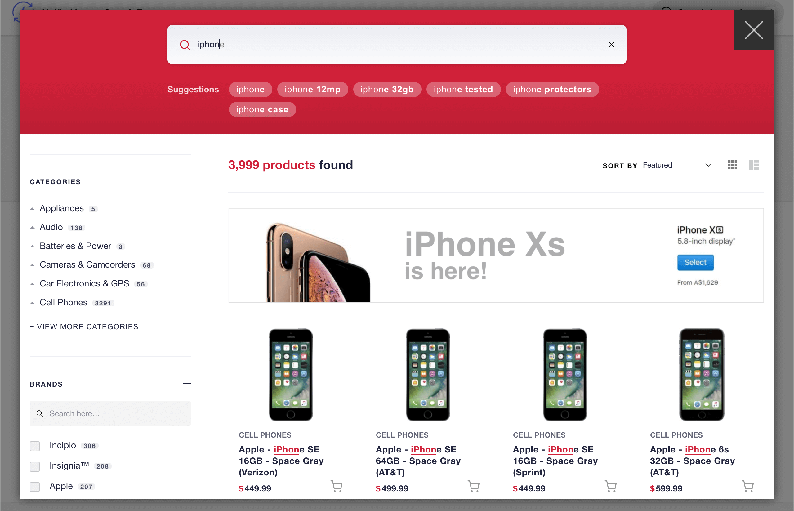

  <h1>Unified InstantSearch for Ecommerce</h1>
  
<strong>A ready-to-use, fully functional Search & Discovery UI on top of InstantSearch</strong>

---

Build your Ecommerce Search & Discovery experience in no time using this framework-agnostic prebuilt UI that offers out-of-the-box a robust as-you-type InstantSearch experience, while retaining the customizability of [Algolia InstantSearch](https://www.algolia.com/doc/guides/building-search-ui/what-is-instantsearch/js/).

Designed to accelerate your Algolia integration, this mobile-optimised UI has been created to best fit any website UI via its full page overlay and offers a direct access to the following Algolia key features:

- Typo proof as-you-type InstantSearch experience
- Query Suggestions
- Advanced Analytics with A/B testing
- Dynamic Re-ranking
- Personalization
- Merchandising capabilities, including banners via Rules

On the frontend side, once compiled, the total package weighs under 300kb and runs on any existing website, regardless of the framework used (see [Browser support](#browser-support)). Its impact on Core Vitals is almost transparent.

#### [**See Live Demo ↗**](https://unified-instantsearch-ecommerce.netlify.app)

## Documentation

The [documentation](https://www.algolia.com/doc/guides/building-search-ui/resources/unified-instantsearch/react/) offers a few ways to learn about Unified InstantSearch for Ecommerce:

- Read the [Getting Started](https://www.algolia.com/doc/guides/building-search-ui/resources/unified-instantsearch/tutorials/getting-started/react/) tutorial to setup your local version of Unified InstantSearch and integrate it into your website
- Find out how to [Use Your Own Data](https://www.algolia.com/doc/guides/building-search-ui/resources/unified-instantsearch/tutorials/using-your-own-data/react/) by formatting it specifically for Unified InstantSearch and pushing it to Algolia
- Learn how to [Customize the UI](https://www.algolia.com/doc/guides/building-search-ui/resources/unified-instantsearch/tutorials/customizing-your-ui/react/) to make it blend with your website's branding
- Setup advanced [Merchandising and Rules](https://www.algolia.com/doc/guides/building-search-ui/resources/unified-instantsearch/tutorials/merchandising-and-rules/react/) to promote items and add banners

You can also go to the wiki to access the full [Configuration options](https://github.com/algolia/unified-instantsearch-ecommerce/wiki/Configuration-options) reference.

## Disclaimer

> Unified InstantSearch for Ecommerce is made accessible to you for trial and experimentation purposes. You may decide to use it or not. You are aware that the use of Unified InstantSearch for Ecommerce in production may increase your consumption of the Service, including [Queries Per Second](https://www.algolia.com/doc/faq/monitoring/which-queries-are-counted-as-part-of-the-max-qps-computations/).
> 
> Unified InstantSearch for Ecommerce source code is provided "as is" and "as available" without any support or warranty of any kind. For purposes of our [SLA](https://www.algolia.com/policies/sla), the Unified InstantSearch for Ecommerce is not an "API Client".

## Browser support

Unified InstantSearch for Ecommerce supports the **last two versions of the major browsers** (Chrome, Edge, Firefox, Safari) as well as Internet Explorer 11.

## How to contribute

We welcome all contributors, from casual to regular :blue_heart:. See [CONTRIBUTING](CONTRIBUTING.md) for more information about the contribution process.

- **Bug report**. Is something not working as expected? [Send a bug report](https://github.com/algolia/unified-instantsearch-ecommerce/issues/new?template=Bug_report.md).
- **Feature request.** Would you like to add something? [Send a feature request](https://github.com/algolia/unified-instantsearch-ecommerce/issues/new?title=Feature%20request%3A).
- **Documentation.** Did you find a typo in the doc? [Open an issue](https://github.com/algolia/unified-instantsearch-ecommerce/issues/new).

See [Installation](CONTRIBUTING.md#installation) for instructions on how to install the project.

## License

Unified InstantSearch for Ecommerce is [Apache-2.0 licensed](LICENSE).
